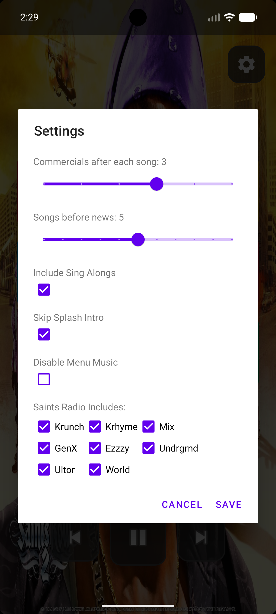
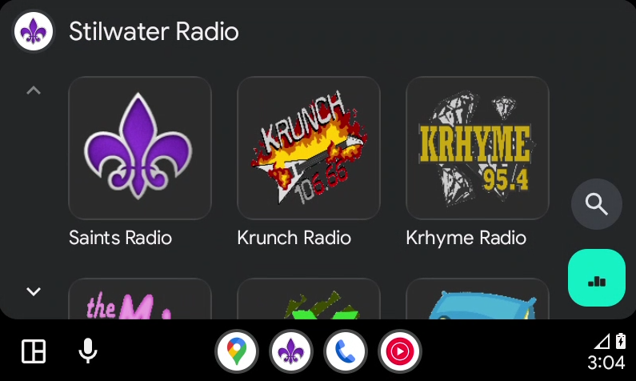
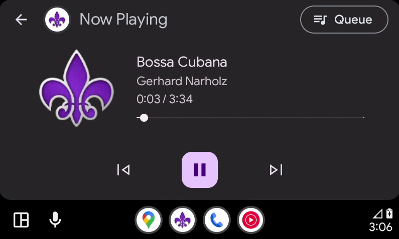

# Stilwater Radio: A Saints Row 2 Radio Station Player

> **Disclaimer:** This is a fan-made project and is not affiliated with, endorsed by, or connected to Deep Silver, Volition, or PLAION. All *Saints Row* trademarks, logos, video, and audio assets are the property of their respective owners. This app is intended for personal, non-commercial use only.

## Overview
**Stilwater Radio** is an Android application designed to recreate the iconic radio stations from *Saints Row 2*. Stilwater Radio includes station-specific songs, themes, and DJ intros/outros. There are user controlled commercial breaks, news reports, and even protagonist "sing-along" versions of songs.

---

## Key Features

### 1. Authentic Station Experience
The app features nine radio stations:
*   **Krunch**: Hard rock.
*   **Krhyme**: Hip-hop and rap.
*   **Mix**: 80s pop and rock.
*   **GenX**: Modern rock.
*   **Ezzzy**: Easy listening.
*   **Undrgrnd**: Indie rock.
*   **Ultor**: Modern rock.
*   **World**: Eclectic world music.
*   **Saints Radio**: A customizable mix curated by the user.

### 2. Rotation Logic
The app uses a randomized rotation logic to mimic the Saints Row 2 radio stations:
*   **Themes & Intros**: Every station start and song transition is accompanied by station tags and DJ commentary.
*   **Shuffle Queue**: The app generates a randomized queue of every song on a station. It plays through the entire library once before reshuffling, ensuring you don't hear the same track twice in a row.
*   **Commercials & News**: Based on your settings, the app automatically inserts commercial breaks and Stilwater news updates between songs.

### 3. Protagonist Sing-Alongs
When enabled, there is a random chance that instead of the standard song, you will hear a version where the game's protagonists sing along like they do in the game.

---

## How to Use the App

### The Main Screen
*   **Selecting a Station**: Tap any of the station logos to tune in. If a station is already playing, tapping its logo will toggle between Play and Pause.
*   **Navigation**: Use the **Skip Next** button to jump to the next segment in the rotation. Use the **Skip Back** button to restart the current track. Use the **Play/Pause** button to toggle playback.
*   **Menu Music**: When the app first opens, the  *Saints Row 2* pause menu music plays until you select your first station, unless the **Disable Menu Music** setting is enabled.
*   **Background**: Every time the app opens, a random *Saints Row 2* background image is chosen.

### Accessing Settings
Tap the **Gear Icon** in the top-right corner to open the **Settings** dialog. This menu is scrollable to ensure accessibility in both portrait and landscape modes.

#### Audio Sliders
*   **Commercials after each song**: Adjust how many commercial spots play during every break (0 to 5).
*   **Songs before news**: Set how many songs should play before a Stilwater News report is broadcast (0 to 10).

#### Global Toggles
*   **Include Sing Alongs**: When checked, the app will randomly choose between standard and sing-along versions of songs.
*   **Skip Splash Intro**: When checked, the THQ and Volition intro videos will be skipped on the next app launch.
*   **Disable Menu Music**: When checked, the *Saints Row 2* pause menu music will not play.

#### Saints Radio Customization
Under the "Saints Radio Includes" section, you can use the checkboxes to select which stations contribute to the Saints Radio mix.
*   *Note: You must select at least 2 stations to save these settings.*

---

## Technical Details

### Persistence
All user preferences (slider values, station inclusions, and intro settings) are saved. Your custom radio configuration will remain exactly as you left it every time you return to the app.

### Orientation Support
The app supports both **Portrait** and **Landscape** modes. The station cluster and controls dynamically adjust their layout to fill the screen.

### Android Auto
Stilwater Radio is built to be compatible with **Android Auto**. You can browse stations, see album art (station tiles), and control playback directly from your vehicle's head unit.

